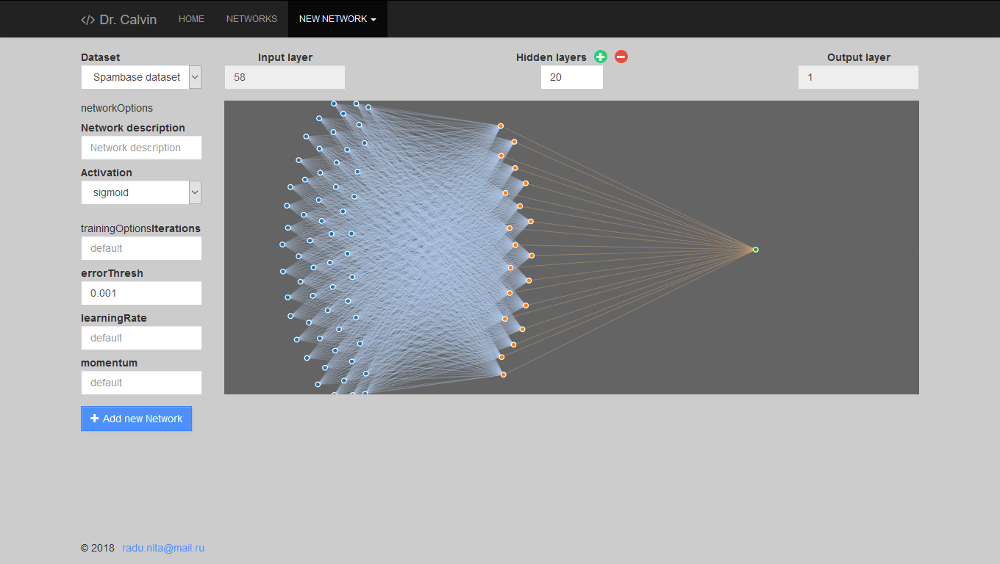

# mlp-generator

JS Project for Generating Simple Artificial Neural Networks


  - [Features](#features)
  - [Getting Started](#getting-started)
    - [Prerequisites](#prerequisites)
    - [Installing](#installing)
  - [TODO](#todo)
  - [Built With](#built-with)
  - [Project Structure](#project-structure)
  - [Versioning](#versioning)
  - [Authors](#authors)
  - [License](#license)
  - [Acknowledgments](#acknowledgments)

## Features

- [x] Visual mode [MLP](https://en.wikipedia.org/wiki/Multilayer_perceptron) Artificial [Neural Networks](https://en.wikipedia.org/wiki/Artificial_neural_network) generation
- [x] Realtime Training ANNs for SPAM classification
- [x] Visualization of training results
- [x] Downloading JSONs of trained ANNs

Soon
- [ ] Multiple datasets
- [ ] Dataset uploading
- [ ] Downloading JS functions of trained ANNs
- [ ] Module for converting images to textual datasets

## Getting Started

These instructions will get you a copy of the project up and running on your local machine for development and testing purposes.

### Prerequisites

- [MongoDB 3.0+](https://mongodb.org/downloads)
- [Node.js 8.0+](https://nodejs.org/en/download)
- [NPM 6.0+](https://www.npmjs.com/get-npm)

### Installing

If you have [git](https://git-scm.com), you can install `mlp-generator` via [git clone](https://git-scm.com/docs/git-clone):

```bash
# Get the latest snapshot
git clone -b master https://github.com/Lure-of-Lysergide/mlp-generator

# Change directory
cd mlp-generator

# Install NPM dependencies
npm install

# Then simply start the application
node index.js
```

## TODO

Front-end:
- [ ] Review the [networks view](views/networks.pug) :
  - [ ] Change `Datatables` plug-in with a better solution
  - [ ] Add modals for non-implemented buttons
- [ ] Review the visualization code :
  - [ ] Use `D3.js` for charting instead `Highcharts.js`
  - [ ] Don't hardcode the array with colors
  - [ ] Creating of graphs must not be done with different functions for [network](views/network.pug) and [network-form](views/network-form.pug) views
- [ ] Use `Webpack` or something like that
- [ ] Reorganize client-side JavaScript :
  - [ ] DRY
  - [ ] Implement concatenation of *.js files
  - [ ] Implement minification of *.js files
  - [ ] Don't use `jQuery`
- [ ] Maybe rewrite the fron-ent with `Angular` (or something else)

Back-end:
- [ ] Deploy
- [ ] Add functionality for multiple dataset processing
  - [ ] Rewrite the [db middleware](middlewares/db.js)
  - [ ] Add functionality for uploading datasets to server
  - [ ] Add functionality for editing datasets
  - [ ] Extend readable dataset formats to *.json, *.csv, *.xls
- [ ] Review the [Network Controller](controllers/network.js) and reorganize the async code (maybe with `Rx.js`)
- [ ] Add functionality for continue training after 
- [ ] Add functionality for listing and deleting Weights (without Networks) in DB
- [ ] Add functionality for converting images to textual datasets

Documentation:
- [ ] Add `CHANGELOG`

## Built With

Back-end:
* [brain.js](https://github.com/BrainJS/brain.js) - artificial neural network library
* [Node.js](http://nodejs.org) - JavaScript runtime
* [Express](http://expressjs.com) - server-side framework for `Node.js`
* [MongoDB](https://www.mongodb.com) - document-oriented NoSQL database
* [mongoose](http://mongoosejs.com) - `MongoDB` object modeling library
* [pug](https://pugjs.org) - template engine

Front-end:
* [D3.js](https://d3js.org) - data manipulation and visualization library
* [Highcharts.js](https://highcharts.com) - charting library
* [Datatables](https://datatables.net/) - table plug-in for `jQuery`
* [Bootstrap](https://getbootstrap.com) - front-end component library
* [jQuery](https://jquery.com/) - JavaScript library (added only for supporting `Datatables` and `Bootstrap` scripts)

## Project Structure

| Name                        | Description                                        |
| --------------------------- | -------------------------------------------------- |
| **config**/                 | Database URI and connection options                |
| **controllers**/api.js      | Controller for JSON API routes                     |
| **controllers**/network.js  | Main controller for Neural Networks                |
| **controllers**/router.js   | Controller for routing pages                       |
| **db**/                     | The SPAMBASE dateset                               |
| **middlewares**/db.js       | Script for reading data from spambase dataset      |
| **models**/                 | Mongoose schema and models for Neural Networks     |
| **public**/                 | Static assets (css, fonts, img, js, lib, favicon)  |
| **public**/**css**/main.css | Compiled and minified css                          |
| **public**/**fonts**/       | Font-Awesome files                                 |
| **public**/**js**/          | Client-side JavaScript                             |
| **public**/**lib**/         | Client-side JavaScript dependencies                |
| **src**/**css**/            | Bootstrap, Font-Awesome and some themes            |
| **src**/**css**/main.scss   | Main style overrids file                           |
| **views**/                  | Pug templates for each page                        |
| **views**/**partials**/     | Base layout, navbar and footer partial templates   |
| index.js                    | The entry point of application with cluster module |
| server.js                   | The Express server and route definitions           |
| package.json                | NPM dependencies                                   |
| package-lock.json           | Exact versions of NPM dependencies                 |

## Versioning

This project use [SemVer](http://semver.org/) for versioning. For the versions available, see the [tags on this repository](https://github.com/your/project/tags). 

## Authors

* **Niţa Radu** - *Initial work* - [Lysergide](https://github.com/Lure-of-Lysergide)

## License

This project is licensed under the MIT License - see the [LICENSE](LICENSE) file for details

## Acknowledgments

This project use the [Spambase Data Set](https://archive.ics.uci.edu/ml/datasets/spambase) from [UCI Machine Learning Repository](http://archive.ics.uci.edu/ml)